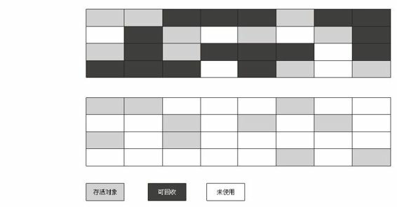

<!-- GFM-TOC -->
* [Java 常见面试题及答案](#java-常见面试题及答案)
* [一、Java 基础](#一java-基础)
    * [JDK 和 JRE 有什么区别？](#jdk-和-jre-有什么区别)
    * [equals 和 == 有什么区别？](#equals-和--有什么区别)
    * [为什么重写 equals 方法必须重写 hashcode 方法？](#为什么重写-equals-方法必须重写-hashcode-方法)
    * [String 为何不可变？如何实现的不可变？](#string-为何不可变如何实现的不可变)
    * [StringBuilder 和 StringBuffer 有什么区别？应用场景？](#stringbuilder-和-stringbuffer-有什么区别应用场景)
    * [ArrayList 和 LinkedList 的区别？](#arraylist-和-linkedlist-的区别)
    * [谈谈 final 在 Java 中的应用？](#谈谈-final-在-java-中的应用)
    * [HashMap 相关](#hashmap-相关)
        * [存储结构](#存储结构)
        * [为何是 2 倍扩容？](#为何是-2-倍扩容)
        * [如何进行冲突处理？](#如何进行冲突处理)
        * [多线程下的 HashMap](#多线程下的-hashmap)
    * [Error 和 Exception 有什么区别？](#error-和-exception-有什么区别)
    * [什么是多态？如何体现多态？](#什么是多态如何体现多态)
    * [NIO、BIO、AIO](#niobioaio)
    * [反射](#反射)
    * [深拷贝和浅拷贝](#深拷贝和浅拷贝)
* [二、JMM 与并发](#二jmm-与并发)
    * [什么是线程安全](#什么是线程安全)
    * [volatile 变量是什么？](#volatile-变量是什么)
    * [synchronized](#synchronized)
* [三、JVM](#三jvm)
    * [Xmx 和 Xms 如何使用？](#xmx-和-xms-如何使用)
    * [可达性分析算法](#可达性分析算法)
    * [垃圾回收算法](#垃圾回收算法)
        * [1. 标记 - 清除算法](#1-标记---清除算法)
        * [2. 复制算法](#2-复制算法)
        * [3. 标记 - 整理算法](#3-标记---整理算法)
        * [4. 分代收集算法](#4-分代收集算法)
    * [垃圾收集器](#垃圾收集器)
        * [Serial 收集器](#serial-收集器)
        * [ParNew 收集器](#parnew-收集器)
        * [Parallel Scavenge 收集器](#parallel-scavenge-收集器)
        * [Serial Old 收集器](#serial-old-收集器)
        * [Parallel Old 收集器](#parallel-old-收集器)
        * [CMS 收集器](#cms-收集器)
        * [G1 收集器](#g1-收集器)
    * [类加载机制](#类加载机制)
        * [类初始化时机](#类初始化时机)
        * [类加载器](#类加载器)
        * [双亲委派模型](#双亲委派模型)
    * [Java 内存模型](#java-内存模型)
* [四、框架](#四框架)
    * [对 Spring IoC 的理解？](#对-spring-ioc-的理解)
    * [Spring MVC 的请求流程](#spring-mvc-的请求流程)
* [五、数据库](#五数据库)
    * [索引](#索引)
        * [聚集索引与非聚集索引](#聚集索引与非聚集索引)
        * [索引失效](#索引失效)
    * [MySQL 引擎](#mysql-引擎)
    * [Redis](#redis)
        * [缓存机制](#缓存机制)
    * [乐观锁和悲观锁](#乐观锁和悲观锁)
    * [B 树和 B+ 树](#b-树和-b+-树)
* [六、算法](#六算法)
* [七、其他](#七其他)
* [操作系统](#操作系统)
    * [进程和线程的区别？](#进程和线程的区别)
* [网络](#网络)
    * [GET 和 POST 的区别？](#get-和-post-的区别)
    * [HTTP 1.0、1.1、2.0 的区别？](#http-101120-的区别)
        * [HTTP 1.1 新特性](#http-11-新特性)
        * [HTTP 2.0 新特性](#http-20-新特性)
<!-- GFM-TOC -->


# Java 常见面试题及答案

# 一、Java 基础

## JDK 和 JRE 有什么区别？

JDK 包括了 Java 程序设计语言、Java 虚拟机和 Java API 类库这三部分，是用于支持 Java 开发的最小环境。

JRE 包括 Java API 类库中的 Java SE API 子集和 Java 虚拟机两部分，是支持 Java 程序运行的标准环境。

## equals 和 == 有什么区别？

**==**

> 关系操作符生成的是一个 boolean 结果，它们计算的是操作数的值之间的关系
>
> 《Java 编程思想》

毫无疑问 == 就是一个关系操作符，所以使用 == 计算的是操作数的值之间的关系。

```java
// ①
3 == 3; // true

// ②
String s1 = new String("string");
String s2 = new String("string");
s1 == s2;	// false
```

对于第一种情况，即基本类型，== 直接计算两个操作数之间的关系，返回 true。而对于第二种情况，String 并不是基本类型，存储的不是值，而是所关联的对象在内存中的地址。所以 == 返回 false。（需要注意由于有 String pool 的存在，直接比较 `"String" == "String"` 的话会返回 true。

**equals**

```java
// java.lang.Object

public boolean equals(Object obj) {
    return this == obj;
}
```

由 Object.java 的源代码可以看到 equals 方法是用来比较两个对象的引用是否相等，即是否指向同一个对象，行为和 == 相同。 但大多数的类都会重写 Object 提供的 equals 方法，String 类也不例外，下面我们来看看 String 类的 equals 方法实现：

```java
public boolean equals(Object anObject) {
    if (this == anObject) {
        return true;
    }
    if (anObject instanceof String) {
        String anotherString = (String)anObject;
        int n = value.length;
        if (n == anotherString.value.length) {
            char v1[] = value;
            char v2[] = anotherString.value;
            int i = 0;
            while (n-- != 0) {
                if (v1[i] != v2[i])
                    return false;
                i++;
            }
            return true;
        }
    }
    return false;
    }
```

重写后的 equals 方法比较的是字符串中每个字符是否相等。

**总结**

对于 ==，如果作用于基本数据类型的变量，则直接比较其存储的 “值”是否相等；如果作用于引用类型的变量，则比较的是所指向的对象的地址。

对于 equals 方法，如果没有对 equals 方法进行重写，则比较的是引用类型的变量所指向的对象的地址；重写过的 equals 方法比较的一般是对象的值。

## 为什么重写 equals 方法必须重写 hashcode 方法？

默认的 hashCode 方法会利用对象的地址来计算 hashcode 值，不同对象的 hashcode 值是不一样的。 

```java
public boolean equals(Object obj) {
    return (this == obj);
}
```

可以看出 Object 类中的 equals 方法与“ == ”是等价的，也就是说判断对象的地址是否相等。Object 类中的 equals 方法进行的是基于内存地址的比较。 

一般对于存放到 Set 集合或者 Map 中键值对的元素，需要按需要重写 hashCode 与 equals 方法，以保证唯一性。

## String 为何不可变？如何实现的不可变？

**如何实现的不可变**

```java
public final class String  implements java.io.Serializable, Comparable<string>, CharSequence {
    /** The value is used for character storage. */
    private final char value[];
    // ...
}
```

首先，String 类被声明为 final，即不可继承，其他类无法通过继承来改变 String 的行为。

其次，String 在底层是通过 char 类型字符数组 value 来实现存储的，value 同样被设置为了 final，表明 stack 里的这个叫 value 的字符数组引用地址不可变 ，即无法引用其他数组。

最后，String 的方法里都很小心的没有去动 value 里的元素，而且没有对外暴露内部成员字段，所以外部方法无法更改 value 内存储的值。从这三个方面保证了 String 的不可变。

**为何不可变**

**1. 可以缓存 hash 值** 

因为 String 的 hash 值经常被使用，例如 String 用做 HashMap 的 key。不可变的特性可以使得 hash 值也不可变，因此只需要进行一次计算。

**2. String Pool 的需要** 

如果一个 String 对象已经被创建过了，那么就会从 String Pool 中取得引用。只有 String 是不可变的，才可能使用 String Pool。


**3. 安全性** 

String 经常作为参数，String 不可变性可以保证参数不可变。例如在作为网络连接参数的情况下如果 String 是可变的，那么在网络连接过程中，String 被改变，改变 String 对象的那一方以为现在连接的是其它主机，而实际情况却不一定是。

**4. 线程安全** 

String 不可变性天生具备线程安全，可以在多个线程中安全地使用。

> [Why String is immutable in Java?](https://www.programcreek.com/2013/04/why-string-is-immutable-in-java/)

## StringBuilder 和 StringBuffer 有什么区别？应用场景？

**为何要用到 StringBuilder 或 StringBuffer**

有时候需要用多个较短的字符构建字符串。因为字符串时不可变的，所以每次连接字符串都会构建新的 String 对象，既耗时也浪费空间。此时可以采用 StringBuffer 或者 StringBuilder 来解决这个问题。

```java
StringBuilder builder = new StringBuilder();
builder.append("hello, ");
builder.append("world.");
```

构建完成后，调用 `toString()` 方法就可以得到一个 String 对象：

```java
String resultString = builder.toString();
```

**StringBuilder 和 StringBuffer 的区别**

StringBuffer 的效率较低，但允许多线程执行添加或删除字符的操作。

StringBuilder 类是 JDK5.0 引入的 StringBuffer 改进版，它的效率高，但无法并发操作。它们两个的 API 是相同的。

**常用方法**

下面拿 StringBuilder 当做例子来说明常用 API：

- `StringBuilder`：构建一个空的 StringBuilder
- `length()`：返回 StringBuilder 中的代码单元数量
- `append(char c)`：添加一个代码单元并返回 this
- `append(String str)`：添加一个字符串并返回 this
- `setCharAt(int i, char c)`：将第 i 个代码单元设置为 c
- `toString()`：构建字符串

## ArrayList 和 LinkedList 的区别？

1. ArrayList 是实现了基于**动态数组**的数据结构，LinkedList 基于**双向链表**的数据结构。    
2. 对于随机访问 get 和 set，ArrayList 优于 LinkedList，因为 LinkedList 要移动指针。    
3. 对于新增和删除操作 add 和 remove，LinedList 比较占优势，因为 ArrayList 要移动数据。

## 谈谈 final 在 Java 中的应用？

final 可以作用在数据、方法和类上，分别起到不同的效果：

**1. 数据**

声明数据为常量，可以是编译时常量，也可以是在运行时被初始化后不能被改变的常量。

- 对于基本类型，final 使数值不变；
- **对于引用类型，final 使引用不变，也就不能引用其它对象，但是被引用的对象本身是可以修改的**。

```java
final int x = 1;
// x = 2;  // cannot assign value to final variable 'x'
final A y = new A();
y.a = 1;
```

**2. 方法**

声明方法不能被子类覆盖。

**private 方法隐式地被指定为 final**，如果在子类中定义的方法和基类中的一个 private 方法签名相同，此时子类的方法不是覆盖基类方法，而是在子类中定义了一个新的方法。

**3. 类**

声明类无法被继承。

## HashMap 相关

### 存储结构

### 为何是 2 倍扩容？

### 如何进行冲突处理？

### 多线程下的 HashMap

## Error 和 Exception 有什么区别？

Error 和 Exception 是 Java 异常体系中唯二的两个分支，它们均直接继承自 Throwable 类。

Error 是在正常情况下不应该出现的问题，由虚拟机抛出。对于 Error 程序员不需要进行捕获处理，一般也无法进行处理。常见的 Error 如 OOM（OutOfMemoryError），就是因为虚拟机内存不足造成的，我们在应用程序的层次无法对其进行捕获处理。

Exception 大致分为两大类，RuntimeException 和其他异常，如 IOException。对于 RuntimeException，一般是程序自身的问题，如访问数组越界、空指针……这些问题更应该从逻辑方面去解决，而不是去进行异常处理。所以 RuntimeException 和 Error 又被称为「非受查异常」（Unchecked Exception）。

而其他异常是程序运行过程中可以预料的异常，如 FileNotFoundException、EOFExcpetion 等等，程序必须对其进行捕获并进行相应的处理。如果不进行捕获，则必须声明可能抛出的受查异常，让异常「冒泡」。没有被处理的异常会沿着调用链传递下去，如果最终都没有一个方法对其进行处理，那么异常会由虚拟机处理，虚拟机就「死」给你看了。

## 什么是多态？如何体现多态？

正如字面上的意思，多态就是**事物在运行过程中存在多种的状态。**多态的体现需要有三个前提：

1. 要有继承关系 （或者实现接口）
2. 子类要重写父类的方法
3. 父类引用指向子类

例子：

```java
class Person {
    void run() {
        System.out.println(" 人在跑 ");
    }
}

class Student extends Person {
    @Override
    void run() {
        System.out.println(" 学生在奔跑 ");
    }
}

public static void main(String[] args) {
    Person p = new Student();
    p.run();    // 学生在奔跑
}
```

父类引用指向子类对象，调用方法时会调用子类的实现，而不是父类的实现，这就叫多态。 

注意上述的例子是**方法重写**（override），而**方法重载**（overload）并不体现多态。

## NIO、BIO、AIO

## 反射

**什么是反射**

反射机制是 Java 语言提供的一种基础功能，通过反射赋予了程序内省（introspect，即在运行时获取程序类、对象、方法等等构建信息）的能力。

反射主要提供了以下的几种功能：

- 在运行时判断任意一个对象所属的类。
- 在运行时构造任意一个类的对象。
- 在运行时判断任意一个类所具有的成员变量和方法。
- 在运行时调用任意一个对象的方法

**反射的使用场景**

例如经典的 JDBC 应用，对于不同的数据库需要使用不同的连接。

```java
Connection conn = new MySQLConnection();
```

数据库被更换为 Oracle 后，需要修改代码、重新编译……

```java
Connection conn = new OracleConnection();
```

而有了反射，我们可以将数据库连接名写在配置文件中，通过反射动态的调用数据库连接类：

```java
Connection conn = Class.forName("conn").newInstance();
```

另外，最常使用反射的就是各类基础框架，比如 Spring、Hibernate 就大量使用了反射。框架是给调用者提供服务的，但框架怎么知道调用者的类信息、方法信息呢？通过反射。反射同样是动态代理、AOP 等的基础。

## 深拷贝和浅拷贝

- 浅拷贝：对于基本数据类型，拷贝它的值，对于引用数据类型（对象），拷贝它的引用
- 深拷贝：对于基本数据类型和引用数据类型都是拷贝值

**如何实现深拷贝**

- 序列化：将一个对象序列化，再反序列化回来，得到的就是一个全新的对象
- 覆盖实现 clone() 方法：在自定义的 clone() 方法中对引用数据类型在进行一次拷贝即可

# 二、JMM 与并发

## 什么是线程安全

> 当多个线程访问一个对象时，如果不用考虑这些线程在运行时环境下的调度和交替执行，也不需要额外的同步，或者在调用方进行任何其他的协调操作，调用这个对象的行为都可以获得正确的结果，那么这个对象是线程安全的。

以上是《Java 并发编程实战》一书中作者给出的关于线程安全的定义。

## volatile 变量是什么？

一旦一个共享变量（类的成员变量、类的静态成员变量）被 volatile 修饰之后，就具备了两层语义：

1. 保证了不同线程对这个变量进行操作时的可见性，即一个线程修改了某个变量的值，这新值对其他线程来说是立即可见的。
2. 禁止进行指令重排序。
3. **volatile**变量不保证原子性

## synchronized

synchronized 语句需要一个对象的引用；随后会尝试在该对象的管程上执行 lock 动作，如果 lock 动作未能成功完成，将一直等待。当 lock 动作执行成功，就会运行 synchronized 语句块中的代码。一旦语句块中的代码执行结束，不管是正常还是异常结束，都会在之前执行 lock 动作的那个管程上自动执行一个 unlock 动作。

如果是实例方法，synchronized 锁的是调用该方法的实例（即方法体执行期间的 this）相关联的管程。如果是静态方法，锁的是定义该方法的类所对应的 Class 对象。

## synchronized与Lock的区别：

synchronized作用在方法上，使用的锁是this，即当前对象；作用在代码块上，使用的锁可以是任何对象；作用在静态函数上，使用的锁是字节码对象，即类名.class。

| 类别     | synchronized                                                 | Lock                                                         |
| -------- | ------------------------------------------------------------ | ------------------------------------------------------------ |
| 存在层次 | Java的关键字，在jvm层面上                                    | 是一个接口                                                   |
| 锁的释放 | 1、以获取锁的线程执行完同步代码，释放锁 2、线程执行发生异常，jvm会让线程释放锁 | 在finally中必须释放锁，不然容易造成线程死锁                  |
| 锁的获取 | 假设A线程获得锁，B线程等待。如果A线程阻塞，B线程会一直等待   | 分情况而定，Lock有多个锁获取的方式，具体下面会说道，大致就是可以尝试获得锁，线程可以不用一直等待 |
| 锁类型   | 可重入 不可中断 非公平                                       | 可重入 可判断 可公平（两者皆可）                             |

# 三、JVM

## Xmx 和 Xms 如何使用？

Xmx 和 Xms 是 Java 虚拟机启动时的可选参数。

Xmx 指定 Java 虚拟机最大可分配内存，超出此内存将会产生 OutOfMemoryError 异常。Xmx 通常具有默认值 256 MB。 

Xms 指定 Java 虚拟机初始化时占用的内存大小，此项一般没有默认值。

## 可达性分析算法

Java 中的判断对象生存状态的算法是可达性分析。它会通过一系列的称为「**GC Roots**」的对象为起点，从这些节点开始向下搜索。搜索走过的路径称为引用链（Reference Chain），当一个对象到 GC Roots 没有任何引用时，就表明对象已死。

Java 中可以充当 GC Roots 的对象包括以下几种：

- 虚拟机栈（栈帧中的本地变量表）中引用的对象
- 方法区中类静态属性引用的对象
- 方法区中常量引用的对象
- 本地方法栈中 JNI 引用的对象

## 垃圾回收算法

### 	1. 标记 - 清除算法

首先标记出所有需要回收的对象，在标记完成后统一回收所有被标记的对象。算法执行过程如下图所示，上面的为回收前，下面的为回收后。



**不足**：1. 效率问题 2. 空间问题。标记清除之后会产生大量不连续的内存碎片，导致在程序中需要分配较大的对象时，找不到连续内存而不得不提前触发另一次垃圾收集动作。

### 	2. 复制算法

将可用内存按容量分为大小相等的两块，每次只使用其中的一块。当这一块的内存用完了，就将存活的对象复制到另一块上面，然后把已使用过的内存空间一起清理掉。这样就不会产生内存碎片了。


**不足**： 代价太大。一次将内存减小了一半。

### 	3. 标记 - 整理算法

标记的过程与标记 - 清除一样，但后续步骤不是直接对可回收对象进行清理，而是让所有存活的对象都向一端移动，然后直接清理掉端边界以外的内存。


### 	4. 分代收集算法

把 Java 堆分为新生代和老年代，在新生代中选用复制算法，只需要付出少量存活对象的复制成本就可以完成收集。而老年代因为对象存活率高、没有额外空间对它进行分配担保，所以使用标记 - 清除算法或者标记 - 整理算法。

## 垃圾收集器

首先说两个概念：**并发和并行**。

并行：  指两个或多个事件在同一时刻发生。 并行是同时做很多事情。 

并发：  指两个或多个时间在同一时间间隔发生。并发是一次处理很多事情 。

###   	Serial 收集器

是个单线程收集器

### 	ParNew 收集器

### 	Parallel Scavenge 收集器

### 	Serial Old 收集器

### 	Parallel Old 收集器

### 	CMS 收集器

### 	G1 收集器		

## 类加载机制

当程序要使用某个类时，如果该类还未被加载到内存中，则系统会通过加载、连接（验证、准备、解析）、初始化三步来实现对这个类进行初始化。

**加载：** 就是将 class 文件读入内存，并为之创建一个 class 对象，任何类被使用时系统都会建立一个 Class 对象。

**连接：** 连接就是将已经读入内存的类的二进制数据合并到虚拟机的运行时环境中去。

**验证：**目的是为了确保 Class 文件的字节流中包含的信息符合当前虚拟机的要求，并且不会危害虚拟机自身的安全。

**准备：** 负责为类的静态成员分配内存，并设置默认初始化值。

**解析：** 将类的二进制数据中的符号引用替换为直接引用。

**初始化：** 初始化就是对类变量进行赋值及执行静态代码块。

###   类初始化时机	

1. 创建类的实例。（new）
2. 访问类的静态变量，或者为静态变量赋值。注意：
    - 通过子类引用父类的静态变量只会触发父类的初始化，不会触发子类的初始化。
    - 使用 final 修饰的、已在编译期把结果放入常量池的静态字段也不会触发初始化。
3. 调用类的静态方法。
4. 使用反射方式来强制创建某个类或接口对应的 java.lang.Class 对象。
5. 初始化某个类的子类，若父类还有没有初始化，会先初始化父类。
6. 直接使用 java.exe 命令来运行某个主类。

###    类加载器

**启动类加载器（BootStrap ClassLoader）：** C++ 写的，负责加载 \lib 目录下的 jar 包，如 rt.jar

**扩展类加载器（Extension ClassLoader）：** java 代码写的，加载 \lib\ext 目录。

**应用程序加载器（系统类加载器）(Application ClassLoader）：**  加载 ClassPath 上指定的类库，我们可以直接使用这个类加载器，若没有自定义过自己的类加载器，这个就是默认的加载器。

**自定义加载器**

自定义类加载器，需要继承ClassLoader类，并实现findClass方法。

**注意：** 若不想打破双亲委派机制，那么只需要重新findClass即可；若想打破双亲委派机制，那么就重写整个loadClass方法。

###     双亲委派模型

如果一个类加载器收到了类加载的请求，它首先不会自己去尝试加载这个类，而是把请求委托给父加载器去完成，依次向上，因此，所有的类加载请求都应该传递到顶层的启动类加载器中，只有当父加载器在它的搜索范围中没有找到所需的类时，即无法完成加载，子加载器才会尝试自己去加载。

```java
//双亲委派模型的工作过程源码
protected synchronized Class<?> loadClass(String name, boolean resolve)
throws ClassNotFoundException
{
// First, check if the class has already been loaded
Class c = findLoadedClass(name);
if (c == null) {
try {
if (parent != null) {
c = parent.loadClass(name, false);
} else {
c = findBootstrapClassOrNull(name);
}
} catch (ClassNotFoundException e) {
// ClassNotFoundException thrown if class not found
// from the non-null parent class loader
//父类加载器无法完成类加载请求
}
if (c == null) {
// If still not found, then invoke findClass in order to find the class
//子加载器进行类加载 
c = findClass(name);
}
}
if (resolve) {//判断是否需要链接过程，参数传入
resolveClass(c);
}
return c;
}

```

**具体过程：**

（1）当前类加载器从自己已经加载的类中查询是否此类已经加载，如果已经加载则直接返回原来已经加载的类。 

（2）如果没有找到，就去委托父类加载器去加载。父类加载器也会采用同样的策略，查看自己已经加载过的类中是否包含这个类，有就返回，没有就委托父类的父类去加载，一直到启动类加载器。因为如果父加载器为空了，就代表使用启动类加载器作为父加载器去加载。 

（3）如果启动类加载器加载失败，会使用拓展类加载器来尝试加载，继续失败则会使用AppClassLoader来加载，继续失败则会抛出一个异常ClassNotFoundException，**然后再调用当前加载器的findClass()方法进行加载。** 

**双亲委派模型的好处：** 

（1）主要是为了安全性，避免用户自己编写的类动态替换 Java的一些核心类，比如 String。 

（2）同时也避免了类的重复加载，因为 JVM中区分不同类，不仅仅是根据类名，相同的 class文件被不同的 ClassLoader加载就是不同的两个类。 


## Java 内存模型

# 四、框架 

## 对 Spring IoC 的理解？

## Spring MVC 的请求流程

用户在 Web 浏览器中点击 URL 或者提交表单的时候，就开始了请求的工作。

请求的第一站是 DispatcherServlet。DispatcherServlet 在此充当一个前端控制器（front controller）的角色。所有的请求都经由 DispatcherServlet，它将请求转发给具体的控制器来处理。

控制器是一个用于处理请求的 Spring 组件，通常存在多个控制器，所以 DispatcherServlet 需要知道将请求发送给哪个控制器。DispatcherServlet 会去查询处理器映射（handler mapping），来确定下一站在哪。处理器映射会根据请求携带的 URL 来决定请求应该交给哪个控制器来处理。

找到了合适的控制器后，DispatcherServlet 会将请求发送给控制器。控制器完成处理后，通常会产生一些信息，这些信息被称为模型（model）。信息的可视化处理需要发送给一个视图（view），通常是 JSP。

控制器将模型数据打包，并标识出用于渲染输出的视图名，然后将其发送给 DispatcherServlet。DispatcherServlet 接收到后，使用视图解析器（view resolver）将逻辑的视图名匹配为一个特定的视图实现。最后，视图将模型数据渲染，输出，并返回给客户端。


# 五、数据库

## 索引

### 聚集索引与非聚集索引

### 索引失效

## MySQL 引擎

## Redis

### 缓存机制

## 乐观锁和悲观锁

## B 树和 B+ 树

# 六、算法

# 七、其他

# 操作系统

## 进程和线程的区别？

**进程是资源分配的最小单位，线程是 CPU 调度的最小单位。**线程是不拥有资源的（或者说只拥有极少的保证自己足以运行的资源），线程可以访问属于进程的资源。

线程是进程的子集，一个进程可以拥有多个线程。同一进程下的线程资源共享，而不同的进程间如果想要共享数据只能通过进程间通信（IPC）来实现。

一个运行中的程序通常对应一个进程，但通常对应多个线程。如我们登录 QQ 后，可以一边给朋友发信息一边接收朋友的信息，如果只有一个线程，想接收新的消息就只能等你的消息发送完毕后才行。多线程使得计算机的多任务并发处理更加方便快捷。

最后，开销方面，线程间切换的开销远远小于进程切换的开销。

# 网络

## GET 和 POST 的区别？

- GET 也可以用来提交信息，但提交后信息的内容会显示在 URL 后缀上，不用来提交敏感数据
- POST 有一个消息体，GET 只有请求头
- GET 幂等（还有 PUT、HEAD)，POST 不幂等（幂等，反复做一件事情而没有副作用）

## HTTP 1.0、1.1、2.0 的区别？

### HTTP 1.1 新特性

**Host 域**

HTTP 1.0 并不对 Host 域做要求，当然加上也不会有问题。HTTP 1.1 明确规定了 Host 域。

```
GET / HTTP/1.1
Host: www.blahblahblahblah.com
```

Host 域可以使多个站点部署在同一个主机上，Web 服务器根据 Host 域的信息将请求分发给不同的站点。

**默认长连接**

HTTP 1.0 需要使用 keep-alive 参数来告知服务器端要建立一个长连接，而 HTTP 1.1 默认支持长连接。 

短连接：浏览器和服务器每进行一次 HTTP 操作，就建立一次连接，任务结束就中断连接

长连接：连接建立后就一直保持连接，无论是否使用，直到一方关闭连接（多是客户端关闭连接）

**100 状态码**

该状态码表示服务器已经接收到请求头，并且客户端应继续发送请求主体（在需要发送请求体的请求的情况下：例如，POST 请求），或者如果请求已经完成，忽略这个响应。服务器必须在请求完成后向客户端发送一个最终响应。响应代码 417 期望失败表示请求不应继续。

**OPTIONS 方法**

OPTIONS 方法是用于请求获得由 Request-URI 标识的资源在请求 / 响应的通信过程中可以使用的功能选项。通过这个方法，客户端可以在采取具体资源请求之前，决定对该资源采取何种必要措施，或者了解服务器的性能。

### HTTP 2.0 新特性

**HPACK 算法**

HTTP 1.1 不支持 header 数据的压缩，而 HTTP 2.0 引入了 HPACK 算法对 header 的数据进行压缩，使得 header 体积更小

**多路复用**

HTTP 2.0 使用了多路复用的技术，做到同一个连接并发处理多个请求，而且并发请求的数量比 HTTP 1.1 大了好几个数量级

**服务器推送**

HTTP 2.0 引入了服务器推送，即服务端向客户端发送比客户端请求更多的数据。这允许服务器直接提供浏览器渲染页面所需资源，而无须浏览器在收到、解析页面后再提起一轮请求，节约了加载时间。 
